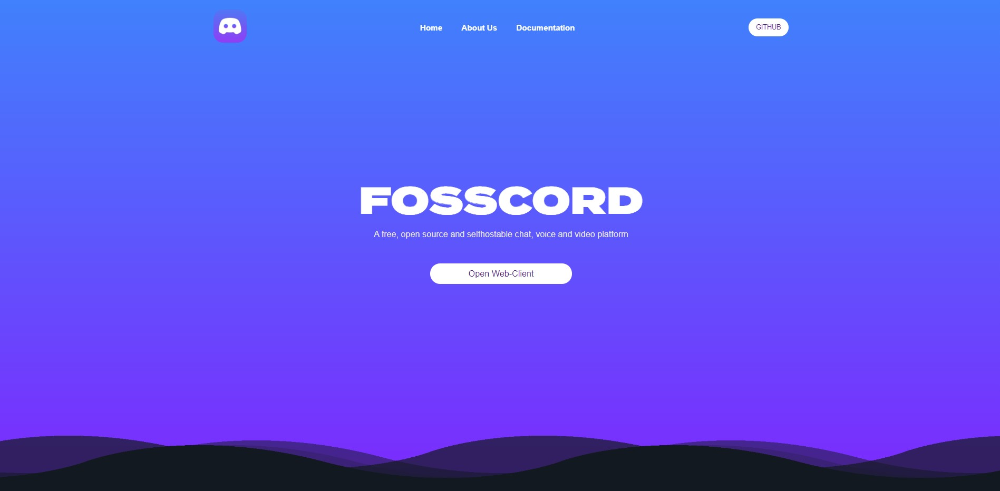
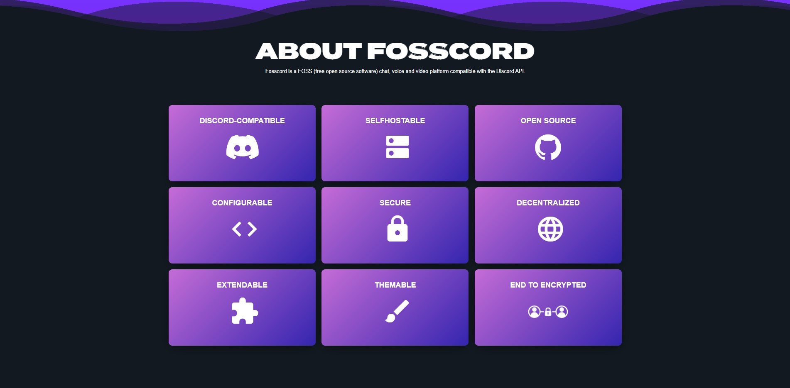

# [Fosscord landing page](https://fosscord.com)

 

The official website of Fosscord.

This project was generated with [Angular CLI](https://github.com/angular/angular-cli) version 11.2.1.

## Setup

First, clone the repository:

`git clone git@github.com:fosscord/fosscord-landingpage.git`

### Install

For testing:
`npm install`

## Development server

Run `ng serve` for a dev server. Navigate to `http://localhost:4200/`. The app will automatically reload if you change any of the source files.

## Build

Run `ng build` to build the project. The build artifacts will be stored in the `dist/` directory. Use the `--prod` flag for a production build.

## Running unit tests

Run `ng test` to execute the unit tests via [Karma](https://karma-runner.github.io).

## Running end-to-end tests

Run `ng e2e` to execute the end-to-end tests via [Protractor](http://www.protractortest.org/).

# Screenshots

